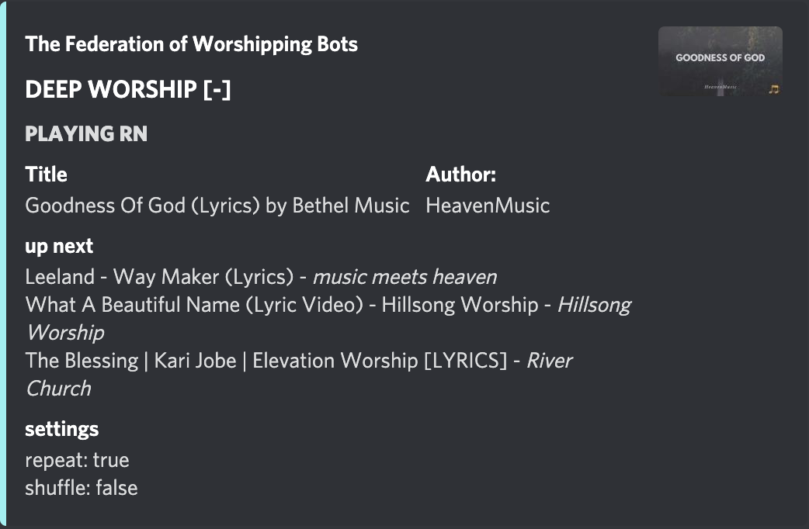

**Playlist Music Bot for YT**
====
<br>
This is just a small Music Bot for Discord. It has pretty plain functions, so yeah. 
The language the bot is answering is german, so maybe you need to adjust the texts in the commands ;) 😅
<br><br>

**🎧HAVE FUN LISTENING🎧**

<br>

#### **⚠️CAUTION⚠️**
This is a code for a bot to selfhost it on a server or raspberryPI. For more information how to host a Discord bot on a raspi pls click on this link --> [click here](https://anidiots.guide/hosting/hosting-on-a-raspberry-pi)

<br>

## **How to install**
_____
<br>

1. clone the repo to a directory your choosing
   
    `git clone [LINK]`

2. open the folder in the terminal and install all required packages

    `npm install`

3. edit / create your config.json file
    - Option 1: editing / creating a file with nano, a text editor for the terminal (you can also use any other text editor)
    - Option 2: editing / creating the file on your PC and pushing it to the folder afterwards

    You can rename the *"config_sample.json"* to *"config.json"* and just edit all the information. *(see config section down here)*

4. start the bot
   
    `node main.js`

<br>

## **Functions**
______
<br>

- setMBControlRoom **[TextChannelID]**: *sets the room the bot will listen to*
- setPlaylist: **[PlaylistID]**: *Does what is says 🤷🏻‍♂️😂*
- updatePlaylist: *updates the playlist*
- setMusicRoom **[VoiceChannelID]**: *sets a new music room*
- join: *joins the specified voicechannel*
- play: *start playing music*
- next: *plays the next song*
- shuffle: *activates/deactivates the "shuffled" mode
- repeat: *activates/deactivates the repeat*

<br>

## **config.json**
_______
<br>
This is how your config.json should look like: 
<br>

```json
{
    "token": "YOUR_BOT_TOKEN",
    "prefix": "YOUR_PREFIX",
    "botControlRoomID": "THE_ROOM_THE_BOT_LISTENS_TO",
    "musicRoomID": "THE_ROOM_WHERE_TO_PLAY_MUSIC",
    "djRoleID": "YOUR_ROLE_ID", //not explicitly needed
    "name": "TITLE_OF_THE_EMBED",    
    "author": "THE_AUTHOR_OF_THE_EMBED",
    "color": "COLOR_OF_THE_EMBED"
}
```
<br><br>
## **screenshots**
_______

<br>

